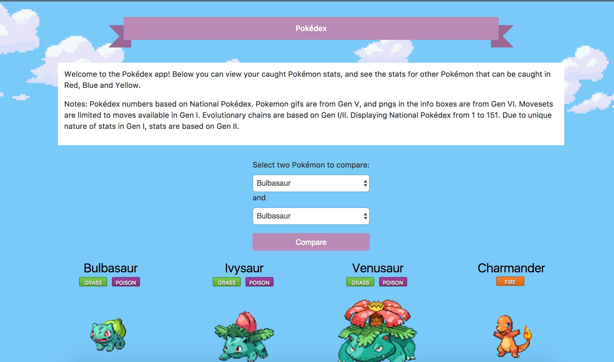
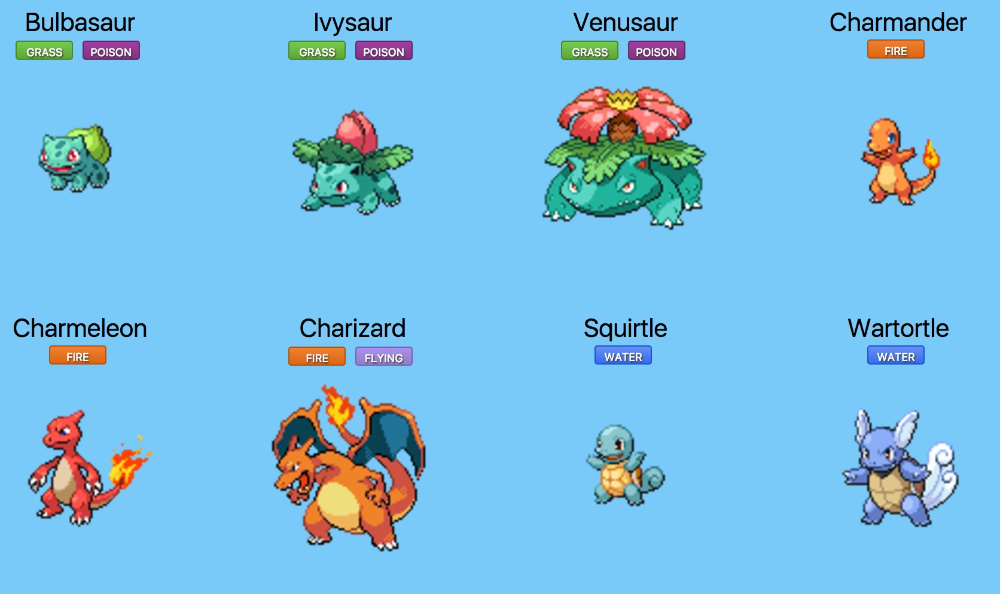

# Storemons
This application is for storing and performing various analyses of all Pokémon as of Pokémon Sun and Moon (Generation VII). 

## Features
- Displays all Pokémon at /pokedex


- Shows name and sprite on inner page at /pokedex/[dex_num]


## Developing Features
### Compare Pokémon page
_A page to decide which Pokémon would win in a battle_

#### Basic notes
- Calculations are based on **base stats** only. Ignores Effort Value (EV) training and Individual Value (IV) stats. 
- _A ramble_: Categorization of Pokémon into competitive tiers, such as how Smogon does it, is far more subjective and complex and changes frequently depending on the current metagame. A more thorough compare page in the future could include basic type comparisons.
- Page will assume that both Pokémon are level 100.

#### Stat comparison method
- Every Pokémon has 6 basic stats: Attack, Special Attack, Defense, Special Defense, Speed and HP.
- To determine how a Pokémon compares against others for each stat, there will be a bar, built in d3, marking that Pokémon's base stat against the others. Pokémon will only be compared against others in _their own evolutionary tier_. So a Bulbasaur will not be stacked against its evolution counterpart, Ivysaur (or Venusaur). The comparison page will still run overall, but it will also be noted that the two Pokémon are in different evolutionary tiers.
- Every stat will have a [calculation](https://mashimo.wordpress.com/2013/07/06/quartiles-and-summary-statistics-in-python/) for upper and lower quartile (_note, finish writing this_):
```def upper_quartile(values):
  sortedVals = sorted(values)
  mid = len(sortedVals)/2
  if (len(sortedVals) % 2 == 0):
    # even
    upperQ = median(sortedVals[mid:])
    if (len(sortedPoints) % 2 == 0):
```
- Stats will be laid out and highlighted if in the upper or lower quartile. Weaknesses do not have specific labels, but strengths have labels in the metagame:
  - High Attack: Physical Sweeper
  - High Special Attack: Special Sweeper
    - Both: Mixed Sweeper
  - High Defense: Physical Wall
  - High Special Defense: Special Wall
     - Both: Mixed Wall
- Then the comparison will begin.
  - Check the stats_sum of both Pokémon
  - If stats_sum differs by 200 or more, then the larger stat wins.
    - Message: “{Pokemon A} wins by sheer power. Try comparing two Pokémon with similar stats.”
  - Otherwise, check individual stats:
    - Physical Attack - > Defense
    - Special Attack - > Special Defense
    - Speed < - > Speed
    - HP < - > HP
  - Print where each Pokémon wins each comparison, and by how much.

### Other
- Set of models for storing personal Pokémon attributes, including model methods for "evolve", "release", "transfer"
- A section to keep track of obtained mega evolution stones (basically equivalent to owning a -Mega Pokémon)
- Set of models for storing personal Pokémon attributes
- /pokedex filters:
  -  gif_mode to show all 'mons as cute gifs
  -  show or hide caught 'mons

## Libraries and Outside Code
- [PokéAPI](https://github.com/PokeAPI/pokeapi): all base models and data are from the PokéAPI repository, without which there would be far less data I would be willing to put into this application myself.
- Bootstrap 4

## Notes for the developer
1. Create a virtual environment. (http://docs.python-guide.org/en/latest/dev/virtualenvs/)
  `virtualenv env`
2. Install Django. Make sure you have Python 3 by running `python3 --version`
  `pip install Django`
3. Create project
  `django-admin startproject pokesite`
4. Create app
  `python manage.py startapp pokedex`

## Helpful links
https://www.twilio.com/blog/2014/11/build-your-own-pokedex-with-django-mms-and-pokeapi.html
http://pykemon.readthedocs.io/en/latest/usage.html
https://tutorial.djangogirls.org/en/django_start_project/
